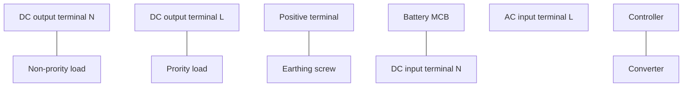
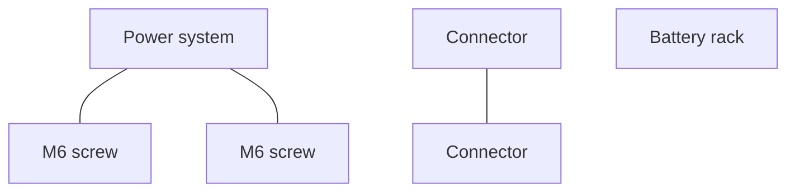
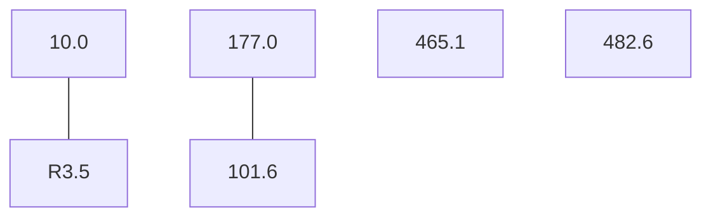
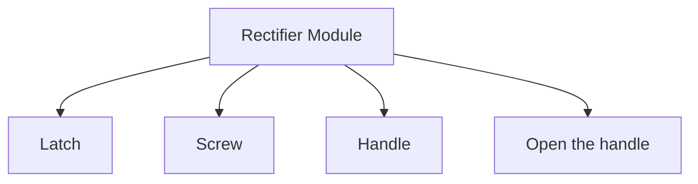
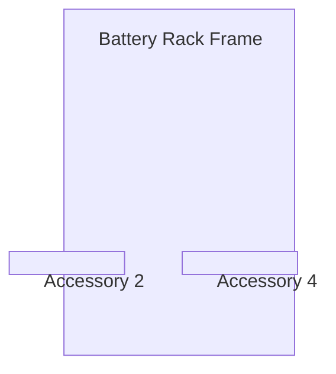
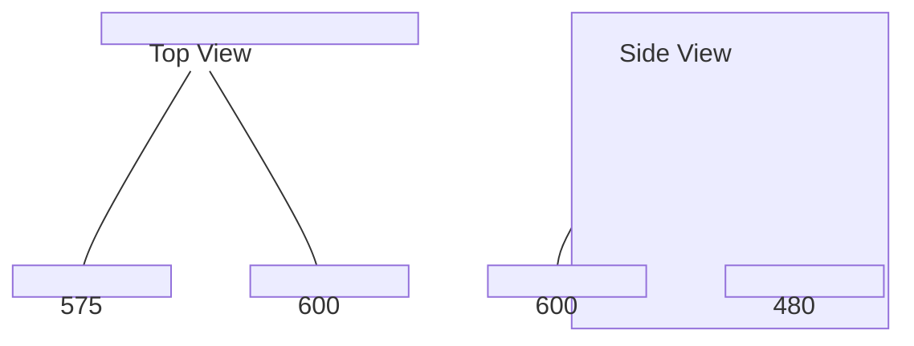
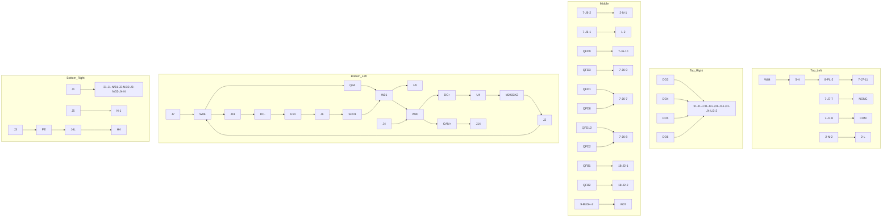
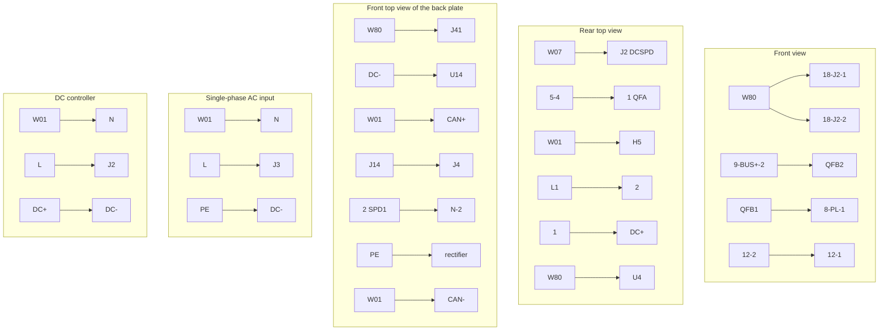
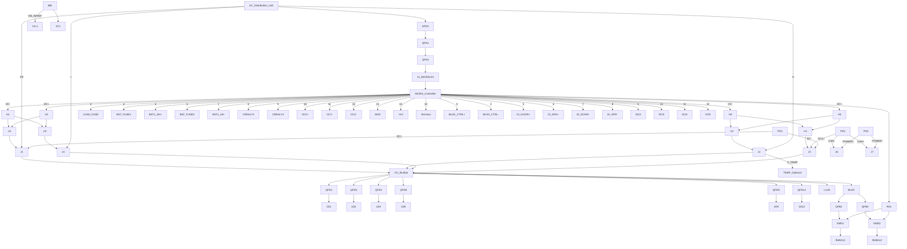
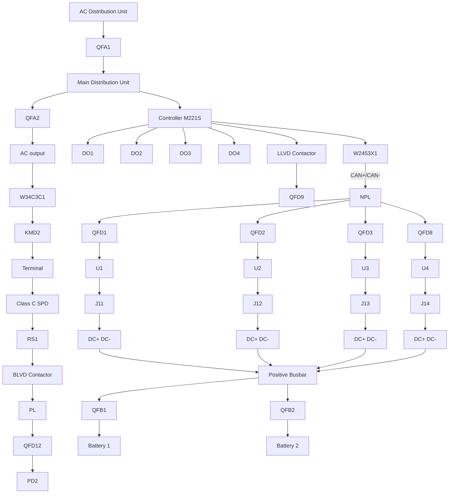

# Chunk 1
# NetSure 732 Subrack Power System User Manual

资料版本 V1.1 Version V1.1

归档日期 2019-12-22 Revision date December 22, 2019

BOM 编码

艾默生网络能源有限公司为客户提供全方位的 Vertiv provides customers with technical support.

用户可与就近的艾默生网络能源有限公司办事处或客户服务中心联系，也可直接与公司总部联系。

艾默生网络能源有限公司 Copyright © 2014 by Vertiv., Ltd.

版权所有，保留一切权利。内容如有改动，恕不另行通知。 All rights reserved. The contents in this document are subject to change without notice.

艾默生网络能源有限公司 Vertiv Co., Ltd.

Address: Block B2, Nanshan I Park, No.1001

地址：深圳市南山区学苑大道 1001 号南山智园 B2 栋

邮编：518055 Homepage: www.vertiv.com.cn

E-mail: Support@vertiv.com

客户服务热线：4008876510

E-mail：Enpc.service@vertiv.com


# Chunk 2
# Safety Precautions

To reduce the chance of accident, please read the safety precautions very carefully before operation. The "Caution, Notice, Warning, Danger" in this book do not represent all the safety points to be observed, and are only supplement to various safety points. Therefore, the installation and operation personnel must be strictly trained and master the correct operations and all the safety points before actual operation.

When operating Emerson products, the safety rules in the industry, the general safety points and special safety instructions specified in this book must be strictly observed.


# Chunk 3
## Electrical Safety


# Chunk 4
### I. Hazardous voltage

⚠️ Danger

Some components of the power system carry hazardous voltage in operation. Direct contact or indirect contact through moist objects with these components will result in fatal injury.

Safety rules in the industry must be observed when installing the power system. The installation personnel must be licensed to operate high voltage and AC power.

In operation, the installation personnel are not allowed to wear conductive objects such as watches, bracelets, bangles, rings.

When water or moisture is found on the Subrack, turn off the power immediately. In moist environment, precautions must be taken to keep moisture out of the power system.

"Prohibit" warning label must be attached to the switches and buttons that are not permitted to operate during installation.

⚠️ Danger

High voltage operation may cause fire and electric shock. The connection and wiring of AC cables must be in compliance with the local rules and regulations. Only those who are licensed to operate high voltage and AC power can perform high voltage operations.


# Chunk 5
### II. Tools

⚠️ Warning

In high voltage and AC operation, special tools must be used. No common or self-carried tools should be used.


# Chunk 6
### III. Thunderstorm

⚠️ Danger

Never operate on high voltage, AC, iron tower or mast in the thunderstorm.

In thunderstorms, a strong electromagnetic field will be generated in the air. Therefore the equipment should be well earthed in time to avoid damage by lightning strikes.


# Chunk 7
## IV. ESD

![ESD icon] Notice

The static electricity generated by the human body will damage the static sensitive elements on PCBs, such as large-scale ICs. Before touching any plug-in board, PCB or IC chip, ESD wrist strap must be worn to prevent body static from damaging the sensitive components. The other end of the ESD wrist strap must be well earthed.


# Chunk 8
## V. Short circuit

![Danger icon] Danger

During operation, never short the positive and negative poles of the DC distribution unit of the system or the non-grounding pole and the earth. The power system is a constant voltage DC power equipment, short circuit will result in equipment burning and endanger human safety.

Check carefully the polarity of the cable and connection terminal when performing DC live operations.

As the operation space in the DC distribution unit is very tight, please carefully select the operation space.

Never wear a watch, bracelet, bangle, ring, or other conductive objects during operation.

Insulated tools must be used.

In live operation, keep the arm muscle tense, so that when tool connection is loosened, the free movement of the human body and tool is reduced to a minimum.


# Chunk 9
## VI. Dangerous energy

![Warning icon] Warning

More than 240VA system capacity, keep away from hazardous energy and avoid bridge connection.


# Chunk 10
## Battery

![Danger icon] Danger

Before any operation on battery, read carefully the safety precautions for battery transportation and the correct battery connection method.

Non-standard operation on the battery will cause danger. In operation, precautions should be taken to prevent battery short circuit and overflow of electrolyte. The overflow of electrolyte will erode the metal objects and PCBs, thus causing equipment damage and short circuit of PCBs.

Before any operation on battery, pay attention to the following points:

- Remove the watch, bracelet, bangle, ring, and other metal objects on the wrist.
- Use special insulated tools.
- Use eye protection device, and take preventive measures.
- Wear rubber gloves and apron to guard against electrolyte overflow.
- In battery transportation, the electrode of the battery should always be kept facing upward. Never put the battery upside down or slanted.


Battery installation requires reliable grounding. And battery is connected before accessing the battery protection device.


# Chunk 11
## Others


# Chunk 12
### I. Sharp object

⚠️ Warning

When moving equipment by hand, protective gloves should be worn to avoid injury by sharp object.


# Chunk 13
### II. Cable connection

⚠️ Notice

Please verify the compliance of the cable and cable label with the actual installation prior to cable connection.


# Chunk 14
### III. Binding the signal lines

⚠️ Notice

The signal lines should be bound separately from heavy current and high voltage lines, with binding interval of at least 150mm.

NO_CONTENT_HERE


# Chunk 15
# Contents


# Chunk 16
# Chapter 1 Overview

1.1 Composition and Configuration


# Chunk 17
# Chapter 2 Installation Instruction

2.1 Safety Regulation

2.2 Preparation

2.3 Mechanical Installation

2.4 Electrical Installation


# Chunk 18
# 2.4.1 Power System Cabling Method


# Chunk 19
# 2.4.2 Connecting AC Cables


# Chunk 20
# 2.4.3 Connecting Load Cables


# Chunk 21
# 2.4.4 Connecting Battery Cables


# Chunk 22
# 2.4.5 Connecting Signal Cables


# Chunk 23
# Chapter 3 Commissioning


# Chunk 24
# 3.1 Installation Check and Startup


# Chunk 25
# 3.2 Basic Settings


# Chunk 26
# 3.3 Alarm Check And System Operation Status Check


# Chunk 27
# 3.4 Final Steps


# Chunk 28
# Chapter 4 Troubleshooting


# Chunk 29
# 4.1 Controller Alarms And Fault Handling


# Chunk 30
# 4.2 Rectifier Fault Handling


# Chunk 31
# 4.2.2 Rectifier Fan Replacement


# Chunk 32
# Appendix 1 Technical And Engineering Data


# Chunk 33
# Appendix 2 Installation Instruction Of Battery Rack


# Chunk 34
# 1. Installation Instruction Of Two-Layer And Four-Layer Battery Rack


# Chunk 35
# 2. Installation Instruction Of Three-Layer Battery Rack


# Chunk 36
# 3. Fixing The Battery Rack


# Chunk 37
# Appendix 3 Wiring Diagram


# Chunk 38
# Appendix 4 Schematic Diagram


NO_CONTENT_HERE


Chapter 1    Overview    1


# Chunk 39
# Chapter 1    Overview

This chapter introduces model composition and configuration and features of NetSure 732 and NerSure 732 (abbreviated as 'power system' hereinafter).


# Chunk 40
## 1.1 Composition and Configuration


# Chunk 41
### Composition

The power system is composed of power distribution、rectifier modules and controller module.

Take NetSure732 for example, the internal structure is shown as Figure 1-1.



Figure 1-1  NetSure 732 system instruction


# Chunk 42
### Configuration

The configuration of the power system is listed in Table 1-1.

| Item                                  | NetSure 732                             | NetSure 732                              |
| ------------------------------------- | --------------------------------------- | ---------------------------------------- |
| Controller                            | Model：M225S                             | Model：M221S/M222S                        |
| Rectifier                             | Model：                                  | Model：                                   |
|                                       | C400/48-3000e3                          | C400/48-3000e3                           |
|                                       | Maximum configuration：4 pieces          | Maximum configuration：4 pieces           |
| AC power distribution                 | L＋N＋PE/220Vac/ 220VDC                   | L＋N＋PE/220Vac/ 220VDC                    |
| DC power distribution<br/>(Customize) | PL：                                     | PL：                                      |
|                                       | 32A/1P×2;16A/1P×2 MCB                   | 32A/1P×2;16A/1P×2 MCB                    |
|                                       | NPL：<br/>63A/1P×2;32A/1P×4;16A/1P×2 MCB | NPL：<br/>63A/1P×2; 32A/1P×4;16A/1P×2 MCB |
| AC output MCB                         | 1×16A/1P                                | 1×16A/1P                                 |
| Battery MCB                           | 2×125A/1P                               | 2×125A/1P                                |
| AC SPD                                | 1 piece                                 | 1piece                                   |
| DC SPD                                | 1piece                                  | 1piece                                   |
| Cover                                 | Optional                                | Optional                                 |
| BLVD controller control<br/>mode      | Controller power-losing mode            | Conteoller power-losing mode             |


# Chunk 43
### Main Features

- The rectifier uses the active Power Factor Compensation(PFC) technology and the power factor is up to 0.99.
- The power system has wide AC input voltage: 85Vac～300Vac. DC input voltage: 190Vdc～410Vdc.
- The rectifier uses soft switching technology, raising the efficiency above 95.5％.
- The rectifier has Ultra-low radiation. With advanced EMC design, the rectifier meets international standards such as CE、NEBS and YD/T983.Both the conducted and radiated interference reach Class B.

NetSure 732 Subrack Power System  User Manual

NetSure 732 Subrack Power System User Manual


- The rectifier safety design complies UL, CE and NEBS.
- The rectifier is of high power density.
- The rectifier is hot pluggable. It takes less than 1 min to replace a rectifier.
- The rectifier has two optional over-voltage protection methods: hardware protection and software protection. The latter one also has two optional modes: lock-out at the first over-voltage and lock-out at the second over-voltage.
- The controller module has perfect battery management. The management functions include BLVD, temperature compensation, auto voltage regulation, stepless current limiting, battery capacity calculation and on-line battery test, etc.
- History alarm records: M221S/M222S controller supports 200 history alarms and 1000 history data records, M225S controller supports 200 history alarms and 512 history data records.
- Battery test data: can record up to 10 sets of battery test data.
- The power system is of network design. Providing multiple communication ports (such as RS232, modem and dry contacts), which enables flexible networking and remote monitoring.
- The power system has perfect lighting protection at both AC side and DC side.
- The power system has complete fault protection and fault alarm functions.
- The power system uses "controller power-losing" control mode. In the indoor or outdoor equipment room without guard and maintenance, the "controller power-losing mode" can protect the battery from deep discharge.


Chapter 2  Installation Instruction                    3


# Chunk 44
## 2.1 Safety Regulation

Certain components in this power system carry hazardous voltage and current. Always following the instructions below:

1. Only the adequately trained personnel with satisfactory knowledge of the power system can carry out the installation. The most recent revision of these safety rules and local safety rules in force shall be adhered to during the installation.

2. All external circuits that are below 48V and connected to the power system must comply with the requirements of SELV as defined in IEC 60950.

3. Make sure that the power (mains and battery) to the system is cut off before any operations can be carried out within the system cabinet.

4. The power cabinets shall be kept locked and placed in a locked room. The key keeper should be the one responsible for the power system.

5. The wiring of the power distribution cables should be arranged carefully so that the cables are kept away from the maintenance personnel.


# Chunk 45
## 2.2 Preparation


# Chunk 46
### Unpacking inspection

The equipment should be unpacked and inspected after it arrives at the installation site. The inspection shall be done by representatives of both the user and Emerson Network Power Co., Ltd.

To inspect the equipment, you should open the packing case, take out the packing list and check against the packing list that the equipment is correct and complete. Make sure that the equipment is delivered intact.


# Chunk 47
### Cables

The cable should be selected in accordance with relevant industry standards.

It is recommended to use the RVVZ cables as AC cables. The cable should reach at least +70°C temperature durability. With cable length shorter than 30 meters, the Cross-Sectional Area (CSA) calculation should be based on the current density of 3.5A/mm2. The suggested CSA value is no less than the Table 2-1.

| AC MCB rated current | Max. AC input current | Min cable CSA | Max cable CSA |
| -------------------- | --------------------- | ------------- | ------------- |
| 125A                 | 74A                   | 25mm2         | 50mm2         |


The CSA of DC cable depends on the current flowing through the cable and the allowable voltage drop. To select the battery cable CSA, see Table 2-2, select the DC load cable CSA according to the Table 2-3.

| Battery MCB rated current | Max. battery current | Min cable CSA | Max cable length( volt drop: 0.5V with max. CSA) |
| ------------------------- | -------------------- | ------------- | ------------------------------------------------ |
| 125A                      | 105A                 | 35mm2         | 6m                                               |


Note:
1. The specs are applicable at ambient temperature of 25°C.
2. The battery cable should reach at least +90°C heat durability. It is recommended to use double-insulated copper-core flame retardant cable as battery cable.

NetSure 732 Subrack Power System  User Manual


Chapter 2 Installation Instruction

| Load route rated current | Max. output current | Min. cable CSA | Max cable length ( volt drop: 0.5V with min. CSA) | Max. cable CSA | Max cable length ( volt drop: 0.5V with max. CSA) |
| ------------------------ | ------------------- | -------------- | ------------------------------------------------- | -------------- | ------------------------------------------------- |
| 63A                      | 50A                 | 16mm2          | 9m                                                | 25mm2          | 14m                                               |
| 32A                      | 25A                 | 10mm2          | 11m                                               | 25mm2          | 29m                                               |
| 16A                      | 12A                 | 6 mm2          | 14m                                               | 25mm2          | 48m                                               |


Note: The specs are applicable at ambient temperature of 25°C. If the temperature is higher than this, the CSA of the cable should be increased.

To prevent the air switching capacity is too large, the load doesn't work when overload. Recommended the capacity of the air switching is up to 1.5~2 times of the load peak.

The CSA of the system grounding cables should be consistent with the largest power distribution cables. The CSA value is no less than 25mm2.

AC distribution、DC distribution interface definition see Table 2-4.

| Connector name        | Connector specifications | Wiring instruction                                         |                                                |
| --------------------- | ------------------------ | ---------------------------------------------------------- | ---------------------------------------------- |
| AC power distribution | AC input MCB             | H type terminal, max. cable CSA 50mm2                      | AC power line                                  |
|                       | Grounding busbar         | One M8 bolt, OT type wiring terminal, max. cable CSA 35mm2 | Connected to the grounding bar of the building |
| DC power distribution | Battery output MCB       | H type terminal, max. cable CSA 50mm2                      | Connected to the battery port                  |
|                       | Negative output MCB      | H type terminal, max. cable CSA 25mm2                      | Connected to the users negative load port      |
|                       | Positive busbar          | Terminal subrack terminal：cable CSA ≤ 50mm2                | Connected to the users positive load port      |


# Chunk 48
## 2.3 Mechanical Installation


# Chunk 49
### Note

1. The cabinet or rack that installed in the subrack must provide fireproof and electric protection casing, or install in cement or other difficult to burn, at the same time keep enough distance to other combustible material.

2. For the convenience of maintenance, users should maintain a clearance of 800mm at the front of the power system.

3. Subrack cannot be installed against the wall, it must leave enough space for heat dissipation.


# Chunk 50
### Installed on the battery rack

Fix the subrack power system to the battery rack through the connectors with M6 bolts, as show in Figure 2-1.


# Chunk 51
# Chapter 2 Installation Instruction 5



Figure 2-1 Cabinet and rack installation


# Chunk 52
## Installed in cabinet

Insert the subrack power system to the matching cabinet, as shown in Figure 2-2.


Figure 2-2 Installed in the cabinet system

The engineering graphics of the subrack power system as shown in Figure 2-3.



Figure 2-3 Installation size of NetSure 732 (unit: mm)

NetSure 732 Subrack Power System User Manual


6     Chapter 2  Installation Instruction

📝 Note

1. Tighten the captive screw of the MFU Panel by the cross head screwdriver when there is no operation.
2. Also tighten the handle by the cross head screwdriver.
3. Please plug in the new modules or installing a new panel after removing the rectifier module.


# Chunk 53
## 2.4 Electrical Installation


# Chunk 54
### 2.4.1 Power System Cabling Method

Cabling from the top of the power system

Epoxy board top cover and rubber ring top cover are optional for this system.

📝 Note

If the user requires the system to meet the CE certification, install the epoxy board top cover to be installed at a distance of 1.8 meters high above the ground.

Epoxy board top cover for MFU unit cabling. As shown in the Figure 2-4.

```
+--------------------------------------------------+
|                    Square unit                   | | |
|+------------------------------------------------+|---|---|
||                                                ||
||                                                || Cable outlet area
||                                                ||
|+------------------------------------------------+|---|---|
|                                                  | | |
|+------------------------------------------------+| Cable-bundling plate
||                                                ||
||                                                || Cable outlet area
||                                                ||
|+------------------------------------------------+|---|---|
|        Signal cable                              | | |
|        outlet holes                              | | |
+--------------------------------------------------+
```

Figure 2-4  Cable entry illustration of the MFU unit

Rubber ring top cover for MFU unit cabling as shown in Figure 2-5.

```
+--------------------------------------------------+
|                                                  | | |
|+------------------------------------------------+|---|---|
||                                                ||
||  +--------+  +--------+  +--------+  +--------+||
|Latex unit                                       || |
||  +--------+  +--------+  +--------+  +--------+||
||                                                || Cable outlet area
||  +--------+  +--------+  +--------+  +--------+||
||  +--------+  +--------+  +--------+  +--------+||
||                                                ||
|+------------------------------------------------+| | |
+--------------------------------------------------+
```

Figure 2-5  Cable entry illustration of the MFU unit

Cabling from side of the power system

Use a cross head screwdriver to remove two screws which fix the cabling panel at side of cabling area, then the cable can be led out from the cabling area, as shown in Figure 2-6.

NetSure 732 Subrack Power System     User Manual


Chapter 2    Installation Instruction    7

```
                                Screw
                                  |
                                  v
 +---------------------------------+
 |  • • •                          |
 |  |                     +-----+  |  Cable-bunding plate
 |  •                     |     |  |  (cabling area)
 |  |                     +-----+  |
 |                                 |
 |  • |                      • •   |
 +---------------------------------+
```

Figure 2-6    Side cabling illustration


# Chunk 55
## 2.4.2 Connecting AC Cables

⚠️ Danger

1. Switch off all MCBs and fuses before the electrical connection.
2. Only the qualified personnel shall do the power cable connection.

Take the NetSure 732 power system for example, the position of the connection terminals are shown in Figure 2-7.

```
AC output terminal N    AC output terminal L
         |                      |
         v                      v
+----------------------------------+
|                              •   | <- Earthing screw
| [][][][][][][][][][][][][][] |   |
| [][][][][][][][][][][][][][] |   | <- DC output terminal N
|                              |   |
|                              |   | <- DC output terminal L
+----------------------------------+
```

Figure 2-7    Illustration of the connection terminal

📝 Note

1. Recommended tightening torque of user grounding screw is 10.78N*M.
2. In case system earthing cable lessen, please add another fixing point except for the earthing screw.


# Chunk 56
## 2.4.3 Connecting Load Cables

Connect the negative load cable to the upper terminal of load MCB and then connect the positive load cable to positive terminal. As shown in Figure 2-8.

```
Positive terminal ->  •
                   +----------------------------------+
                   |                              •   |
                   | [][][][][][][][][][][][][][] |   |
Load MCB ->        | [][][][][][][][][][][][][][] |   |
                   |                              |   |
                   |                              |   |
                   +----------------------------------+
```

Figure 2-8    Illustration of the load connection terminal

NetSure 732 Subrack Power System    User Manual


Note

1. The batteries may have dangerous current. Before connecting battery cables, make sure that the battery MCBs at the battery side are switched off.
2. If there are no battery MCBs at the battery side, users should disconnect any one of the connectors between battery cells to avoid live state of the system after installation.
3. Be careful not to reversely connect the battery. Otherwise, both the battery and the system will be damaged.
4. It's forbidden to disassemble battery cables in the up of the battery MCB when the battery input port is still connected.

Connect one end of the negative battery cable to the upper terminal of battery MCBs. Connect one end of the positive battery cable to the DC positive bus bar.
Connect copper lugs to the other end of the battery cables. Bind the connecting parts with insulating tape, and put them beside the battery. Connect the cables to the battery when the DC distribution unit is to be tested. As shown in Figure 2-9.

Positive terminal

Battery MCB

Figure 2-9 Illustration of the battery connection terminal


Connecting NetSure 732 Signal Cables

The standard configuration of the system is M225S controller. The M225S1X1 user interface board is used for M225S. M225S controller and M225S1X user interface board cable connection is shown in the following:

Interface board

Figure 2-10 NetSure 732 user interface board position illustration

M225S controller provides two dry contact alarm output ports: DO1 and DO2. DO2 is for LLVD in subrack system. If LLVD is selected, it can't be used for dry contact and should be sealed by white tape when out of the factory.


is not selected, It can be used for dry contact. NetSure 732 provides four extended dry contacts: DO3, DO4, DO5 and
DO6, the illustration is as shown in the following:

```
[Image of M225S1X1usr interface board with labeled components]
```

Figure 2-11 M225S1X1usr interface board illustration

Digital output dry contact specification of M225S controller and M225S1X1user interface board is as following:

Digital output: relay isolation, max: 30Vdc 1A, 125Vac 0.5A, 60W; Min: 10uA@10Vdc.

The dry contacts definition of M225S controller and M225S1X1 user interface board is shown in Table 2-5.

| Type | Default alarm                                    | Description                                            |
| ---- | ------------------------------------------------ | ------------------------------------------------------ |
| DO1  | Major alarm                                      | /                                                      |
| DO2  | Load disconnection control                       | LLVD control, user can't use it when LLVD is selected. |
| DO3  | AC failure.                                      |                                                        |
| DO4  | DC overvoltage or DC undervoltage                |                                                        |
| DO5  | Rectifier alarm                                  | Except rectifier lost and multi-rectifier alarm.       |
| DO6  | Battery protection and load disconnection alarm. |                                                        |


In the controller normal state, the alarm contacts are always open, when system issues above alarms, related
contacts will be closed. All the status changes should be verified by a multimeter. After the alarms are removed, the
dry contacts (DO) should back to the open state.

Connecting NetSure 732 Signal Cables

W2453X1 user interface board provides dry contacts for NetSure 732 user interface board position and signal cabling
as shown in Figure 2-12.

```
[Image of NetSure 732 user interface board with labeled components including Signal cable, User interface board, and User interface board (Flexible configuration)]
```

Figure 2-12 NetSure 732 user interface board illustration

At most two W2453X1 user interface boards are allowed in the power system. Standard cabinet is only configured
with one user interface board.

With one W2453X1 user interface board configured, the power system provides four external digital input ports: DI1,
DI2, DI3, DI4 and four dry contact alarm output ports

With two user interface boards configured, the power system provides additional four dry contact alarm output
interfaces: DO5, DO6, DO7, DO8.


# Chunk 57
## Chapter 2 Installation Instruction

The digital input ports of W2453X1 user interface board needs to connect active dry contact. Dry contact spec as following:

Digital output: relay isolation, Max.:30Vdc/1A, 125Vac/0.5A, 60W; Min.: 10uA@10Vdc, alarm is definable.

The functions of the interfaces are shown in Table 2-6.

| Type          | Default alarm                     | Description                                             |
| ------------- | --------------------------------- | ------------------------------------------------------- |
| Dry contact 1 | AC power failure                  | /                                                       |
| Dry contact 2 | DC overvoltage or DC undervoltage | Four-level DC voltage alarms                            |
| Dry contact 3 | Rectifier alarm                   | Except rectifier lost and multi-rectifier alarm         |
| Dry contact 4 | Priority LLVD                     | /                                                       |
| Dry contact 5 | Non-priority LLVD                 | Exist when the second user interface board is installed |
| Dry contact 6 | /                                 | Exist when the second user interface board is installed |
| Dry contact 7 | /                                 | Exist when the second user interface board is installed |
| Dry contact 8 | /                                 | Exist when the second user interface board is installed |


With default settings, when the preceding alarms are generated, the contactors of the corresponding dry contacts should change their status. That is, the normally-open contactors close, and the normally-closed contactors open. All the status changes should be verified by a multimeter. After the alarms are removed, the dry contacts (Do) should back to the original state.

Dry contact definition is settable in the controller, please refer to M221S Controller User Manual.

The user interface board illustration is as shown in the following:

```
                                W2453X1
                                VER A01
            FE           RIc    RLY12009.12.25
             E                  RLY2  74 H
            Eᴱ           R1z    RLY3
             E

                          BAR CODE
```

Figure 2-13 W2453X1 user interface board illustration


# Chunk 58
### Connecting Communication Signal Cable

The RS232 communication port of M225S controller is shown in Figure 2-14.

```
                                ESC

                                ENT
              RS232

RS232 communication                 Dry contact output
          serial port
              6 Rx Tx
```

Figure 2-14 M225S controller communication port

NetSure 732 Subrack Power System User Manual


Chapter 2  Installation Instruction  11

The communication port of the M221S controller is shown in Figure 2-15.M222S only provides the RS232 communication serial port, whereas the Ethernet port is not provided.

Ethernet port

RS232 communication
serial port

Figure 2-15  M221S controller communication port

NetSure 732 Subrack Power System  User Manual


12       Chapter 3  Commissioning


The controllers can be used in the power system are M221S、M222S and M225S. The detail instructions of the controllers please refer to the user manuals. This section introduces commissioning after installation. During installation test, the corresponding safety rules should be adhered to. The system has been tested before out of the factory, user doesn't need to test on site.


# Chunk 59
## 3.1 Installation Check and Startup

Before the test, inform the chief manufacturer representative. Only trained electrical engineer can maintain and operate this equipment. In operation, the installation personnel are not allowed to wear conductive objects such as watches, bracelets, bangles and rings.

During operation, parts of this equipment carry hazardous voltage. Misoperation may result in severe or fatal injuries and property damage. Before the test, check the equipment to ensure the proper earthing. Installation check must be done before testing. Then the batteries can be charged for the first time.

Make sure that the AC input MCBs, battery MCBs and load MCBs are switched off. Make sure that all the devices are properly installed.


# Chunk 60
### Installation check

| Check Item                                                                                                                                                     | OK | Comments |
| -------------------------------------------------------------------------------------------------------------------------------------------------------------- | -- | -------- |
| Check all the fuse and cables. Are the models correct?                                                                                                         | ☑  |          |
| Check the busbar connections, input and output cable connection, and connection between the power system and the system grounding.                             | ☑  |          |
| Check if the number and connections of the batteries are correct. Check the polarity of the battery string with a voltmeter.                                   | ☑  |          |
| Make sure all the communication cables and alarm cables are connected to the controller module. Check that the temperature sensor, if any, has been installed. | ☑  |          |


# Chunk 61
### Startup preparations

| Preparation Step                                                                                                                                                                                                                                                                                       | OK | Comments |
| ------------------------------------------------------------------------------------------------------------------------------------------------------------------------------------------------------------------------------------------------------------------------------------------------------ | -- | -------- |
| Make sure that all the MCB are switched off and all the fuses are removed.                                                                                                                                                                                                                             | ☑  |          |
| Measure the AC input voltage. Make sure the input voltage is within the allowable range.                                                                                                                                                                                                               | ☑  | Umin＝ V  |
| Check that communication and alarm cables are connected to the signal transfer board.                                                                                                                                                                                                                  | ☑  |          |
| Check that the temperature sensor, if any, has been installed.                                                                                                                                                                                                                                         | ☑  |          |
| Check that the battery string circuit is not closed.                                                                                                                                                                                                                                                   | ☑  |          |
| Connect the disconnected batteries to the battery string circuit.                                                                                                                                                                                                                                      | ☑  |          |
| Make sure that the MCB disconnected to the battery cables are switched off. Check the battery signal cables connection and MCB cables connection.                                                                                                                                                      | ☑  |          |
| Measure with a voltmeter across the connection points of each battery and make sure that the polarity is right. For a lead-acid battery with 24 cells, the voltmeter should read 2.0 \~ 2.1V/cell or 48 \~ 51V/battery. If the voltage of certain cell is lower than 2.0V, that cell must be replaced. | ☑  | Umin＝ V  |
| Check with an ohmmeter that there is no short circuit between the positive & negative distribution bus bars, or between the positive & negative battery poles (Note: Pull out all modules before the check and restore them after the check).                                                          | ☑  |          |


# Chunk 62
### Startup

| Startup Step                                                                                                                                                                                                                                                                           | OK | Comments |
| -------------------------------------------------------------------------------------------------------------------------------------------------------------------------------------------------------------------------------------------------------------------------------------- | -- | -------- |
| Switch on the system AC input MCB. Insert one rectifier. The green LED on the rectifier will be on and the fan will start running after a certain delay. The controller module will show that the power supply voltage is 53.5V( when it used for outdoor, the output voltage is 54V). | ☑  |          |
| Check the system voltage and busbar polarity with a voltmeter. The voltage difference between the measured value and displayed value should be less than±0.2V.                                                                                                                         | ☑  |          |
| Start and stop each rectifier of the system by inserting and unplugging the rectifier. Check their output voltages.                                                                                                                                                                    | ☑  |          |


NetSure 732 Subrack Power System    User Manual


When the system is put into service for the first time, the parameters of controller module must be set based on the actual system configuration, such as battery number, capacity, user’s charge current limit and other functional requirements. Only after that can the controller module display system operation information and control the output. (M221S,M222S controller password is 2; M225S controller password is 1)

The system model has been set correctly in factory before delivery, check that the setting agrees with the actual system.

(The path to check and set of the M221S\M222S controller: Settings®Bat. Settings®Basic Settings)

NetSure 732: 48V/SET; battery shunt coefficient: 300A/25mV;

(The path to check and set of the M225S controller: Settings®Shunt A)

NetSure 732: battery shunt coefficient: 300A/25mV

Setting controller according to number of battery groups connected. Default: two groups.

(The path to check and set of the M221S\M222S controller: Settings®Bat. Settings®Basic Settings®Bat.Fuse)

(No such settings for M225S controller)

Setting controller according to the capacity of battery groups connected. Default: 300Ah

(The path to check and set of the M221S\M222S controller: Settings®Bat. Settings®Basic Settings®Capacity)

(The path to check and set of the M225S controller: Settings®Capacity)

Setting LVD1: default: 44V (If the subrack system is used for outdoor, default setting: 46.6V)

(The path to check and set of the M221S\M222S controller: Settings®Bat. Settings®LVD Settings®LVD1 Volt)

(The path to check and set of the M225S controller: Settings®LVD1, default setting: Yes Relay 2 settings “Settings®Relay 2”, default setting “LVD1”)

Setting LVD2: default: 43.2V (If the subrack system is used for outdoor, default setting: 45.6V)

(The path to check and set of the M221S\M222S controller: Settings®Bat. Settings®LVD Settings®LVD2 Volt)

(The path to check and set of the M225S controller: Settings®LVD2)

Setting AC input type. Default value: 1-PH

(The path to check and set of the M221S\M222S controller: Settings®Input Settings®AC PH)

(No such settings for M225S controller)

Walk-in T setting: default: 8S

(The path to check and set of the M221S\M222S controller: Settings®Rect Settings®Walk-in on, default “Y”)

(Settings®Rect Settings®Walk-in T, default “8S”)

(The path to check and set of the M225S controller: Settings®Walk-in T, default “8S”)

Setting controller according to the battery factory. Temperature compensation range: 0～500mV/℃. Default: 72mV/℃.

(The path to check and set of the M221S\M222S controller: Settings®Bat.settings®Temp.Comp)

(No such settings for M225S controller)

Set the charge current limit according to your needs. Setting range: 0.1 C10～0.25C10. Default: 0.1C10

(The path to check and set of the M221S\M222S controller: Settings®Bat. Settings®Charge)

(No such settings for M225S controller)

Set the controller according to the voltage suggested by the battery supplier.

Float charge voltage: 42V～Boost charge (BC), default: 53.5V (If the subrack system is used for outdoor, default voltage: 54V);

Boost charge voltage: Float charge (FC)～58V, default: 56.4V

(The path to check and set of the M221S\M222S controller: Settings®Bat. Settings®Charge)

(The path to check and set of the M225S controller: Settings®Float/Boost)

Settings®Float/Boost

Set the boost charge voltage higher 0.1V than float charge voltage for the free boost charge battery.

Close the battery MCBs and connect the battery.


# Chunk 63
## 3.3 Alarm Check And System Operation Status Check


# Chunk 64
### Alarm check

Check that all functional unit can trigger alarms that can be displayed on the controller.

| OK | Comment                                                                                                                                                                                                                                                                                                                       |
| -- | ----------------------------------------------------------------------------------------------------------------------------------------------------------------------------------------------------------------------------------------------------------------------------------------------------------------------------- |
| ☑  | Pull out one rectifier. The 'Rect N Com Failure' alarm should be triggered. Insert the rectifier in. The alarm should disappear. Repeat the same procedures on other rectifiers                                                                                                                                               |
| ☑  | Switch off battery MCB 1. The 'Batt1 Failure' alarm should be triggered. Switch on the MCB. The alarm should be cleared. Repeat the same on battery MCB 2                                                                                                                                                                     |
| ☑  | Switch off a load MCB connected to a load route. The alarm 'Load Fuse N Failure' should be triggered. Switch on the MCB, and the alarm should be cleared. Repeat the same on the other load MCBs                                                                                                                              |
| ☑  | Remove all the battery MCBs. Keep only one rectifier in operation. Through the controller module, adjust the rectifier FC voltage to make it lower than the alarm point. The alarm 'DC Voltage Low' should be triggered                                                                                                       |
| ☑  | Keep the rectifiers in operation. Set through the controller module the battery management parameter to 'Manual'. Enter the maintenance menu at the controller module. Select 'Disconnect' and confirm it. The battery protection contactor should be open, and the 'BLVD' alarm should be displayed at the controller module |


Note: when the preceding alarms are generated, the controller module will give alarms after approximately 3s.


# Chunk 65
### System operation status check

There should be no alarms during normal system operation. The system operation status can be conducted through the controller module.

| OK | Comments                                                                                                                                                                                                                                                 |
| -- | -------------------------------------------------------------------------------------------------------------------------------------------------------------------------------------------------------------------------------------------------------- |
| ☑  | The system model is correct.                                                                                                                                                                                                                             |
| ☑  | The controller should display the correct AC voltage                                                                                                                                                                                                     |
| ☑  | The controller should be able to display the DC voltage. The difference between the displayed voltage and that measured at the busbar should be less than 1%                                                                                             |
| ☑  | The controller should display the battery current. The difference between the displayed and measured battery current should be less than 1%                                                                                                              |
| ☑  | Check the number of the rectifier through the controller. The number should be consistent with the actual number.                                                                                                                                        |
| ☑  | Check the voltage, current, current limiting point of rectifiers through the controller. They should agree with the actual parameter.                                                                                                                    |
| ☑  | For the system configured with temperature sensor, the controller should be able to display the battery ambient temperature. Hold the probe of the temperature sensor with hand and watch the controller which should display the change of temperature. |


# Chunk 66
## 3.4 Final Steps

| OK | Comments                                                                           |
| -- | ---------------------------------------------------------------------------------- |
| ☑  | Make sure that materials irrelevants to the equipment have been all removed.       |
| ☑  | Rehabilitate the power equipment and close the cabinet door.                       |
| ☑  | Fill in the installation report and hand it over to the user.                      |
| ☑  | Record all the operations in the file, including operation time and operator name. |


If any defect is found in this equipment, inform the personnel responsible for the contract.

If repairing is needed, please fill in the FAILURE REPORT and send the report together with the defective unit to the repairing center for fault analysis.


Chapter 4 Troubleshooting 15


This chapter describes the handling of alarms, as well as the routine maintenance of the system during system daily operation.

The maintenance personnel must have adequate knowledge about the subrack power system.

> Note
> 1. The maintenance must be conducted under the guidance of related safety regulations.
> 2. Only trained personnel with adequate knowledge about the subrack power system shall maintain the inner part of the subrack.


# Chunk 67
## 4.1 Controller Alarms And Fault Handling

The controller alarms are classified into three types: major alarm, observation alarm and no alarm.

Major alarm: This type of alarms have strong impacts on the system performance. Whenever these alarms are generated, users are supposed to handle them immediately. The red major alarm indicators will be on.

Observation: When this type of alarm is raised, the system maintains normal output for a while. If the alarm occurs during watch time, it should be handled immediately. If the alarm occurs during non- watch- time, handle it during watch time. The yellow observation alarm indicators will be on.

No alarm: If alarms are set as 'no alarm' by the users, when these alarms occur, the green alarm indicators will be on and the system works normally.

If an unnecessary alarm occurs during the operation of the controller, set it according to the following method.

Take the alarm of 'Rect Lost' for example:

For M221S/M222S controller: MAIN MENU —> Settings —> Alarm—> Alarm Control—> Clear—> For the submenu of "Clear", you can select "Rect Lost" to clear corresponding alarm.

For M225S controller: Settings->Clear. For the submenu of 'Clear', you can select 'Rect Lost' to clear corresponding alarm.

The handling methods of normal alarms are given in Table 4-1.

| Index | Alarm           | Handling method                                                                                                                                                                                                                                                                                                                                                                                                                                     |
| ----- | --------------- | --------------------------------------------------------------------------------------------------------------------------------------------------------------------------------------------------------------------------------------------------------------------------------------------------------------------------------------------------------------------------------------------------------------------------------------------------- |
| 1     | Mains Failure   | If the failure does not last long, the battery will power the load. If the cause is unknown or the failure lasts too long, a diesel generator is needed. Before using the generator power to supply the subrack power system, it is suggested to run the generator at least five minutes to minimize the impact on the subrack power system                                                                                                         |
| 2     | DC Voltage High | Check if the DC over-voltage value is too low. If yes, change the value. A mild over-voltage does not affect the system operation. However, the rectifiers will stop working operation when the mains voltage is more than target. If the mains voltage is above the DC over-voltagevalue, the mains grid should be improved                                                                                                                        |
| 3     | DC Voltage Low  | Check if the DC Under- voltage point is too high. If yes, change the value. When the mains voltage is lower than set up, the output power of the rectifiers will be derated. And if lowerthan set up, the rectifiers will stop working. If the mains voltage is under the DC under-voltage value, themains grid should be improved                                                                                                                  |
| 4     | SPD alarm       | Check the SPD condition. If the SPD is damaged, replace it                                                                                                                                                                                                                                                                                                                                                                                          |
| 5     | DC Volt High    | Check the DC over-voltage value through the controller. If the setting value is inappropriate, correct it. Otherwise, find out the rectifier that has caused the alarm: 1. Ensure that the batteries can operate normally. 2. Switch off the DC input of all rectifiers. 3. Power on the rectifiers one by one. 4. If the over-voltage protection is triggered when a certain rectifier is powered on, that rectifier is the faulty one. Replace it |


NetSure 732 Subrack Power System User Manual


# Chunk 68
## Chapter 4 Troubleshooting

| Index | Alarm                            | Handling method                                                                                                                                                                                                                                                                                                                                                                                                                                                                                                                                                                                                |
| ----- | -------------------------------- | -------------------------------------------------------------------------------------------------------------------------------------------------------------------------------------------------------------------------------------------------------------------------------------------------------------------------------------------------------------------------------------------------------------------------------------------------------------------------------------------------------------------------------------------------------------------------------------------------------------- |
| 6     | DC Volt Low                      | 1. Check if the alarm is caused by mains failure, if yes, disconnect some loads to prolong the operation of the whole system.<br/>2. Check the DC under-voltage value set through the controller. If the set value is inappropriate, correct it.<br/>3. Check if any rectifier is inoperative, or has no output current. If yes, replace it.<br/>4. Check if the total load current exceeds the total rectifier current during float charge. If yes, disconnect some loads or add more rectifiers to make the total rectifier current bigger than 120% of the total load current with one redundant rectifier. |
| 7     | Load Fuse Alarm, Batt Fuse Alarm | Check if the corresponding MCB is switched off. If the MCB is open, find out the fault and remove it. Otherwise, the alarm circuit is faulty. Please contact Emerson.                                                                                                                                                                                                                                                                                                                                                                                                                                          |
| 8     | LVD2                             | 1. Check if there is mains failure, and the battery voltage is lower than the value of 'LVD2'.<br/>2. Check whether the battery is disconnected from the system manually.                                                                                                                                                                                                                                                                                                                                                                                                                                      |
| 9     | Rect Failure                     | The rectifier with the fault indicator (red) on is faulty.<br/>Power off the rectifier, and then power it on after a while. If the alarm persists, replace the rectifier.                                                                                                                                                                                                                                                                                                                                                                                                                                      |
| 10    | Rect Protect                     | Check if the mains voltage is above 305V or under 80V. If the mains voltage is under the AC under-voltage value or above the AC over-voltage value, the mains grid should be improved.                                                                                                                                                                                                                                                                                                                                                                                                                         |
| 11    | Rect Fan Fails                   | Pull out the rectifier to check if the fan is obstructed. If yes, clean it and push the rectifier back. If the fan is not obstructed or if the fault persists after cleaning, replace the rectifier.                                                                                                                                                                                                                                                                                                                                                                                                           |
| 12    | Rect Not Respond                 | Check if the communication cable is connected properly between rectifier and controller. If yes, restart the rectifier. If the alarm persists, replace the rectifier.                                                                                                                                                                                                                                                                                                                                                                                                                                          |
| 13    | High temperature                 | Check if the temperature of the temperature sensor is too high. If yes, find the causes and cool down the battery compartment.                                                                                                                                                                                                                                                                                                                                                                                                                                                                                 |


# Chunk 69
### Controller fault handling

The symptoms of usual controller faults include: power indicator(green) off. LCD doesn't display( if connected to the host system, it may cause an external alarm). Check whether the system bus voltage is normal. If not, check whether the terminal of the controller is in normal connection. If both are in normal, the controller is faulty, please see the following procedures to replace the controller.

M221S/M222S replacement:
1. Check the new controller for damage.

2. Loosen the captive screw of the controller, as shown in Figure 4-1

Figure 4-1 M221S/M222S Controller replacement

3. Push the new controller into the system and tighten the captive screw of the controller

4. After controller startup, refer to 3.2 Basic Settings

M225S controller replacement:
1. Security preparation
   Put one end of the effective grounding strap at the wrist and the other end attached to a suitable ground.


2. Loosen the captive screw of the controller, as shown in Figure 4-2.

Captive screw

```
                                ESC

                                ENT
                    RS232
                    Rx Tx
```

Figure 4-2 M225S Controller replacement (1)

3. Pull out the controller unit slowly until the J2 terminal is completely exposed, and pull out the connected terminals fromJ2,J6,J7 carefully and do insulation respectively.( as shown in Figure 4-3 ).

```
                J7
                                J2

                        J6
```

Figure 4-3 M225S Controller replacement (2)

4. Push the new controller into the system and insert connection terminals to the corresponding J2, J6 and J7 respectively. Make sure that the connections are fastened, then push the controller into the system.

5. Tighten the captive screw of the controller.

6. After controller startup, refer to 3.2  Basic Settings


# Chunk 70
## 4.2 Rectifier Fault Handling


# Chunk 71
### Alarm handling

The symptoms of usual rectifier faults include: power indicator ( green ) off, protection indicator ( yellow) on, protection indicator blink , fault indicator (red) on and fault indicator blink, the indicator locations as shown:

```
                EMERSON
Power Indicator (Green)    O
Protection Indicator (Yellow)   △
Alarm Indicator (Red)    ●
```

Figure 4-4 Local Indicator Locations

Table 4-2 Rectifier Troubleshooting

| Symptom                          | Related alarm | Possible cause(s)                                            | Suggested action(s)                                                    |
| -------------------------------- | ------------- | ------------------------------------------------------------ | ---------------------------------------------------------------------- |
| Power Indicator (Green) Off      | No alarm      | 1. No input/output voltage.<br/>2. Internal input fuse open. | Make sure that there is input/output voltage<br/>Replace the rectifier |
| Power Indicator (Green) flashing | No alarm      | The rectifier is being identified by the controller          |                                                                        |


# Chunk 72
## Chapter 4 Troubleshooting

| Symptom                             | Related alarm                  | Possible cause(s)                                                       | Suggested action(s)                                                                                                                                                                                                    |
| ----------------------------------- | ------------------------------ | ----------------------------------------------------------------------- | ---------------------------------------------------------------------------------------------------------------------------------------------------------------------------------------------------------------------- |
| Protection (yellow)                 | Rect protection                | DC input voltage abnormal                                               | Make sure the DC input voltage isnormal                                                                                                                                                                                |
|                                     | Rect over temperature          | 1. Fan blocked<br/>2. Ventilation path blocked at the inlet or vent     | 1. Remove the object that blocks the fan<br/>2. Remove the object at the inlet or vent                                                                                                                                 |
|                                     |                                | 3. Ambient temperature too high or the inlet too close to a heat source | 3. Decrease the ambient temperature or remove the heat source                                                                                                                                                          |
| Protection (yellow)                 | Rect protection                | Current sharing imbalance                                               | Check whether the rectifier communication is normal. If not, check whether the communication cable is in normal connection. If the communication is normal while the protection indicator is on, replace the rectifier |
|                                     | Rect protection                | Power factor compensation internal under voltage or over voltage        | Replace the rectifier                                                                                                                                                                                                  |
| Protection indicator flash (yellow) | Rect communication fail        | Rectifier communication fail                                            | Check whether the communication cable is in normal connection                                                                                                                                                          |
|                                     | Rect HVSD                      | Rectifier over-voltage                                                  | Reset the rectifier. If the protection is triggered again, replace the rectifier                                                                                                                                       |
|                                     | Rect fail                      | Rectifier module addresses contradictory.                               | Replace the rectifier module.                                                                                                                                                                                          |
| Fault indicator on(red)             | Severe load sharing imbalance. | positive and negative deviations of average current ≤ 2.5A              | Check whether the rectifier communication is normal. If not, check whether the communication cable is in normal connection. If the communication is normal while the protection indicator is on, replace the rectifie  |
|                                     | Rect Fan Fails                 | Fan fault                                                               | Replace the fan.                                                                                                                                                                                                       |


# Chunk 73
### C400/48-3000e3 Replacement

Rectifier modules can be inserted or removed with power applied (hot swappable).


# Chunk 74
#### Note:

Each rectifier module locks into a module mounting shelf by means of a latch located on the bottom of the module. The latch and rectifier module handle are interactive. Pushing the handle up into the module's front panel causes the latch to extend to the locking position; pulling the handle down out from the module's front panel causes the latch to retract.

⚠️ DANGER!

Take care when removing a rectifier module that was in operation, as rectifier module surfaces could be very hot.

⚠️ WARNING!

To prevent damage to the latching mechanism, ensure the handle is in the open position when installing or removing a rectifier module. NEVER hold the handle in the closed position when installing a rectifier module into a shelf.


# Chunk 75
### Procedure

Refer to Figure 4-5 as this procedure is performed.

1. Performing this procedure may activate external alarms. Do one of the following. If possible, disable these alarms. If these alarms cannot be easily disabled, notify the appropriate personnel to disregard any alarms associated with this system while this procedure is performed.


Chapter 4  Troubleshooting  19

2. Loosen the captive screw on the module's handle. Pull the handle down out from the module's front panel (this will also retract the latch mechanism).

3. Grasp the handle and pull firmly to remove the module from the shelf.

4. Place the replacement rectifier module into the mounting position without sliding it in completely.

5. Loosen the captive screw on the module's handle. Pull the handle down out from the module's front panel (this will also retract the latch mechanism).

6. Push the module completely into the shelf.

7. Push the handle up into the module's front panel. This will lock the module securely to the shelf.  Tighten the captive screw on the handle.

8. Certain functions (i.e. rectifier current limit, rectifier addressing) may require adjustment when adding or replacing a rectifier module.

9. After the rectifier modules are physically installed in the mounting shelf(s), they are ready for operation immediately after power is supplied to them. Verify that the rectifiers are operating normally.

10. Enable the external alarms, or notify appropriate personnel that this procedure is finished.

11. Ensure that there are no local or remote alarms active on the system.



Figure 4-5  Installing Rectifier


# Chunk 76
## 4.2.2 Rectifier Fan Replacement

Each Rectifier uses a fan (P/N:32010485) for cooling. If fan replacement should become necessary, perform the following procedure.

Refer to Figure 4-5 as this procedure is performed.

⚠️ WARNING!

In a system with NO redundant Rectifier, battery must have sufficient reserve to power the load(s) while the Rectifier is removed for fan replacement.

NetSure 732 Subrack Power System  User Manual


# Chunk 77
## Chapter 4 Troubleshooting


# Chunk 78
### Note:

When performing any step in this procedure that requires removal of existing hardware, retain all hardware for use in subsequent steps.


# Chunk 79
### Procedure

1. Performing this procedure may activate external alarms. Do one of the following. If possible, disable these alarms. If these alarms cannot be easily disabled, notify the appropriate personnel to disregard any alarms associated with this system while this procedure is performed.

2. Remove the Rectifier from the shelf. Refer to a previous procedure for step-by-step instructions.

3. On this Rectifier, remove the front panel by removing the screws securing the front panel to the chassis, and by unplugging the fan from the printed circuit card.

4. For proper orientation of the new fan, observe the location of the fan wires and the air flow arrows on the old fan.

5. Remove the old fan from the front panel by removing the two screws and clips securing the fan.

6. Install the new fan onto the front panel using the two screws and clips previously removed. Ensure the fan wires and air flow arrows match the orientation of the old fan.

7. Install the front panel with the new fan onto the chassis by plugging the fan cable into the printed circuit card, and securing the front panel with the screws previously removed.

8. Replace the Rectifier into the shelf. Refer to the previous procedure for step-by-step instructions.

9. Enable the external alarms, or notify appropriate personnel that this procedure is finished.

10. Ensure that there are no local or remote alarms active on the system.

```
                                Fan

                             Faceplate      Screw

Figure 4-6     Fan replacement
```

NetSure 732 Subrack Power System    User Manual


Appendix 1   Technical And Engineering Data   21


# Chunk 80
# Appendix 1   Technical And Engineering Data


# Chunk 81
## Table 1   Technical data

| Parameter category             | Parameter                                        | Description                                                                                                                     |
| ------------------------------ | ------------------------------------------------ | ------------------------------------------------------------------------------------------------------------------------------- |
| Environmental                  | Operating temperature                            | －5℃～＋40℃(derating is necessary above 40°C)                                                                                      |
|                                | Storage temperature                              | －40℃～＋70℃                                                                                                                       |
|                                | Relative humidity                                | 5％RH～95％RH                                                                                                                      |
|                                | Altitude                                         | ≤2000m(derating is necessary above 2,000m)                                                                                      |
|                                | Polution level                                   | Level 2                                                                                                                         |
|                                | Others                                           | No conductive dust or erosive gases. No possibility of explosion                                                                |
| AC input                       | Input system                                     | AC: L＋N＋PE/220Vac；DC: 220Vdc                                                                                                    |
|                                | AC input type                                    | TN，TT                                                                                                                           |
|                                | Input voltage range                              | 85Vac～300Vac; 190Vac～410Vdc;                                                                                                    |
|                                | Input AC voltage frequency                       | 45Hz～65Hz                                                                                                                       |
|                                | Maximum input current                            | ≤74A（including 10A AC output current）；                                                                                          |
|                                | Power factor                                     | ≥0.99                                                                                                                           |
|                                | Overvoltage level                                | Level Ⅱ                                                                                                                         |
|                                | Nominal output voltage                           | －48Vdc                                                                                                                          |
|                                | Rated output voltage                             | －53.5Vdc（If it is used for outdoor，the rated voltage is-54V）                                                                    |
|                                | Output DC voltage                                | －42～－58Vdc                                                                                                                      |
|                                | Maximum output current                           | DC load outpu≤150A<br/>battery charging current≤56A<br/>Note: in 45℃, full load output, above 45℃, the power derating 2% per ℃. |
| DC output                      | Voltage set-point accuracy                       | ≤1％                                                                                                                             |
|                                | Maximum efficiency                               | >95.5％                                                                                                                          |
|                                | Noise (peak-peak) (rated output)                 | ≤200mV（0～20MHz）                                                                                                                 |
|                                | Weighted noise (rated output)                    | ≤2mV（300～3400Hz）                                                                                                                |
|                                | AC input over-voltage alarm point                | Default: 280 ± 5Vac, configurable through controller                                                                            |
| AC input alarm and protection  | AC input over-voltage alarm recovery point       | Default: 270 ± 5Vac, 10Vac lower than the AC input over-voltage alarm point                                                     |
|                                | AC input under-voltage alarm point               | Default: 180 ± 5Vac, configurable through controller                                                                            |
|                                | AC input under-voltage alarm recovery point      | Default: 190 ± 5Vac, 10Vac higher than the AC input under-voltage alarm point                                                   |
|                                | AC input over-voltage protection point           | 305 ± 5Vac by default, configurable through controller                                                                          |
|                                | AC input over-voltage protection recovery point  | 295 ± 5Vac by default, 10Vac lower than the AC input over-voltage alarm point                                                   |
|                                | AC input under-voltage protection point          | Default: 80 ± 5Vac, configurable through controller                                                                             |
|                                | AC input under-voltage protection recovery point | Default: 95 ± 5Vac, 10Vac higher than the AC input under-voltage alarm point                                                    |
|                                | DC output over-voltage alarm point               | Default: -58.0 ± 0.2Vdc, configurable through controller                                                                        |
| DC output alarm and protection | DC output over-voltage recovery point            | Default: -57.5 ± 0.2Vdc, 0.5Vdc lower than the over-voltage alarm point                                                         |
|                                | DC output under-voltage alarm point              | Default: -45.0 ± 0.2Vdc, configurable through controller                                                                        |


NetSure 732 Subrack Power System   User Manual


# Chunk 82
## Appendix 1     Technical And Engineering Data

| Parameter category                                | Parameter                               | Description                                                                                                                                                                                                                                                                                                                                                                                                                             |
| ------------------------------------------------- | --------------------------------------- | --------------------------------------------------------------------------------------------------------------------------------------------------------------------------------------------------------------------------------------------------------------------------------------------------------------------------------------------------------------------------------------------------------------------------------------- |
| DC output alarm and protection                    | DC output under-voltage recovery point  | Default: -45.5 ± 0.2Vdc, 0.5Vdc higher than the under-voltage alarm point                                                                                                                                                                                                                                                                                                                                                               |
|                                                   | DC output over-voltage protection point | Default: -59.0 ± 0.2Vdc, configurable through controller                                                                                                                                                                                                                                                                                                                                                                                |
|                                                   | LLVD                                    | Default: -44.0 ± 0.2Vdc, configurable through controller（If it is used for outdoor，the default is-－46.6±0.2Vdc）                                                                                                                                                                                                                                                                                                                         |
|                                                   | BLVD                                    | Default: -43.2 ± 0.2Vdc, configurable through controller                                                                                                                                                                                                                                                                                                                                                                                |
|                                                   | Current sharing                         | The rectifiers can work in parallel and share the current. The unbalanceness is better than ± 5%.                                                                                                                                                                                                                                                                                                                                       |
|                                                   | Derate by input (at 45°C)               | AC input: 176Vac input, The rectifier output is 100% power                                                                                                                                                                                                                                                                                                                                                                              |
|                                                   |                                         | 154Vac\~176Vac input，the rectifier output power increased from 2900W to 3000W.                                                                                                                                                                                                                                                                                                                                                          |
|                                                   |                                         | 85Vac\~154Vacinput，the rectifier output power increased from 1500W to 2900W.                                                                                                                                                                                                                                                                                                                                                            |
| Below 80Vac，the rectifier low pressure power off. |                                         |                                                                                                                                                                                                                                                                                                                                                                                                                                         |
|                                                   |                                         | DC input: 190VDC to 410VDC.                                                                                                                                                                                                                                                                                                                                                                                                             |
|                                                   | Walk-in                                 | The output voltage can rise slowly when the rectifier start up. The walk in time is configurable through the controller.                                                                                                                                                                                                                                                                                                                |
|                                                   | Fan speed adjustable                    | Rectifier fan speed can be set to auto or full speed.                                                                                                                                                                                                                                                                                                                                                                                   |
| Rectifier                                         | Over-voltage protection                 | The rectifier provides over-voltage hardware and software protection. The hardware protection point is 59.5V ± 0.5V, and it requires manual resetting to restore operation. The software protection point is between 56V and 59V (0.5V above output voltage, 59V by default), and can be set through the controller                                                                                                                     |
|                                                   |                                         | There are two software protection modes, which can be selected through the software at the host:                                                                                                                                                                                                                                                                                                                                        |
|                                                   |                                         | 1. Lock out at the first over-voltage<br/>Once the output voltage reaches protection point, the rectifier will shut off and hold that state. It requires manual resetting to restore the operation                                                                                                                                                                                                                                      |
|                                                   |                                         | 2. Lock out at the second over-voltage<br/>When the output voltage reaches the software protection point, the rectifier will shut down, and restart automatically after 5 seconds. If the over-voltage happens again within a set time (default: 5min. Configurable through controller), the rectifier will shut off and hold that state. It requires manual resetting to restore the operation                                         |
|                                                   |                                         | Manual resetting: Resetting can be done manually through the controller, or by removing the rectifier from system                                                                                                                                                                                                                                                                                                                       |
|                                                   | Temperature power limiting              | The rectifiercan start in -40℃;                                                                                                                                                                                                                                                                                                                                                                                                         |
|                                                   |                                         | Below 45℃, the rectifier with full power (3000 W) output.                                                                                                                                                                                                                                                                                                                                                                               |
|                                                   |                                         | From 45℃\~55℃, the rectifier with linearly derating to 2900W.                                                                                                                                                                                                                                                                                                                                                                           |
|                                                   |                                         | From 55℃\~65℃, the rectifier with linearly derating to 2250W.                                                                                                                                                                                                                                                                                                                                                                           |
|                                                   |                                         | From 65℃\~70℃, the rectifier with linearly derating to 0W.                                                                                                                                                                                                                                                                                                                                                                              |
| EMC                                               | Conducted emission                      | Class A EN55022                                                                                                                                                                                                                                                                                                                                                                                                                         |
|                                                   | Radiated emission                       |                                                                                                                                                                                                                                                                                                                                                                                                                                         |
|                                                   | Harmonic current emission               | Class A EN61000-3-12                                                                                                                                                                                                                                                                                                                                                                                                                    |
|                                                   | Voltage fluctuation and flash           | EN61000-3-11                                                                                                                                                                                                                                                                                                                                                                                                                            |
|                                                   | EFT                                     | Level 4 EN/IEC 61000-4-4                                                                                                                                                                                                                                                                                                                                                                                                                |
|                                                   | ESD                                     | Level 3 EN/IEC 61000-4-2                                                                                                                                                                                                                                                                                                                                                                                                                |
|                                                   | Surges                                  | Level 4 EN/IEC 61000-4-5                                                                                                                                                                                                                                                                                                                                                                                                                |
|                                                   | Radiation                               | Level 3 EN/IEC 61000-4-3                                                                                                                                                                                                                                                                                                                                                                                                                |
|                                                   | Conduction                              | Level 2 EN/IEC61000-4-6                                                                                                                                                                                                                                                                                                                                                                                                                 |
| Lightning protection features                     | At AC side                              | The AC input side can withstand five times of simulated lightning voltage of 5Kv at 10/700μs, for the positive and negative polarities respectively. It can withstand five times of simulated lightning surge current of 20Ka at 8/20μs, for the positive and negative polarities respectively. The test interval is not smaller than 1 minute. It can also withstand one event of simulated lightning surge current of 40kA at 8/20μs. |


NetSure 732 Subrack Power System     User Manual


Appendix 1  Technical And Engineering Data               23

| Parameter category | Parameter             | Description                                                                                                                                                                                                                                                                                                                                                                                                                             |
| ------------------ | --------------------- | --------------------------------------------------------------------------------------------------------------------------------------------------------------------------------------------------------------------------------------------------------------------------------------------------------------------------------------------------------------------------------------------------------------------------------------- |
|                    | Safety regulation     | Conform to IEC60950-1 standards                                                                                                                                                                                                                                                                                                                                                                                                         |
|                    | Acoustic noise        | ≤ 60db (A) (When the ambient temperature is lower than25°C)                                                                                                                                                                                                                                                                                                                                                                             |
|                    | Insulation resistance | At temperature of 15°C \~ 35°C and relative humidity not bigger than 90%RH, apply a test voltage of 500Vdc. The insulation resistances between AC circuit and earth, DC circuit and earth, and AC and DC circuits are all not less than 2MΩ                                                                                                                                                                                             |
| Others             | Insulation strength   | (Remove the SPD, controller and rectifiers from the system before the test.)                                                                                                                                                                                                                                                                                                                                                            |
|                    |                       | AC loop to DC loop can withstand 50Hz. AC to DC circuits: 3,000Vac; or 4,242Vdc for one minute, leak curren≤10mA , without puncturing and electric arcing;                                                                                                                                                                                                                                                                              |
|                    |                       | AC circuit to earth: 50Hz, 2,500Vac; or 3,535Vdc for one minute, leak curren≤10mA , without puncturing and electric arcing ;<br/>DC circuit to earth: 50Hz, 1,000Vac; or 1,414Vdc for one minute, leak curren≤10mA , without puncturing and electric arcing ;<br/>Auxiliary circuit without connecting to the main circuit directly: 50Hz,500Vac; or 707Vdc for one minute, leak curren≤10mA , without puncturing and electric arcing ; |
|                    | MTBF                  | > 350,000hr                                                                                                                                                                                                                                                                                                                                                                                                                             |
|                    | Current (maximum)     | 18 A                                                                                                                                                                                                                                                                                                                                                                                                                                    |
|                    | ROHS                  | Compliant with R5 requirement                                                                                                                                                                                                                                                                                                                                                                                                           |
|                    | Dimensions (mm)       | Standard dimensions of the subracks: 483 mm×390 mm×178 mm                                                                                                                                                                                                                                                                                                                                                                               |
|                    |                       | Controller: M221S\M222S：87×212×42<br/>M225S：43.6×212×42                                                                                                                                                                                                                                                                                                                                                                                 |
|                    |                       | Rectifier: 85.1×330×43.6                                                                                                                                                                                                                                                                                                                                                                                                                |
| Mechanical         | Weight (kg)           | Subrack (package,rectifier and controller are all included): ≤25;                                                                                                                                                                                                                                                                                                                                                                       |
|                    |                       | Subrack (without package,rectifier and controller included): ≤15;                                                                                                                                                                                                                                                                                                                                                                       |


NetSure 732 Subrack Power System    User Manual


24      Appendix 2  Installation Instruction Of Battery Rack


# Chunk 83
# Appendix 2  Installation Instruction Of Battery Rack


# Chunk 84
## 1. Installation Instruction Of Two-Layer And Four-Layer Battery Rack


# Chunk 85
### Packing list

![Figure 1 showing accessories 1 through 5 of the battery rack]

| Accessory<br/>Two-layer battery rack | Battery rack<br/>Four-layer battery rack | Battery rack |
| ------------------------------------ | ---------------------------------------- | ------------ |
| Accessory 1                          | 2                                        | 4            |
| Accessory 2                          | 8                                        | 14           |
| Accessory 3                          | 2                                        | 4            |
| Accessory 4                          | 2                                        | 2            |
| Accessory 5                          | 0                                        | 2            |
| Expansion bolt                       | 4 pieces                                 | 4 pieces     |
| Fastener                             | 1 set                                    | 1 set        |


# Chunk 86
### Installation procedures

1. Installation procedures of two-layer battery rack
   1) Install accessory 1 and accessory 2 according to Figure 2 (a).
   2) Install accessory 3 according to Figure 2 (b).

![Figure 2 showing installation procedure of accessory 1 ~ accessory 3]

NetSure 732 Subrack Power System   User Manual

Appendix 2  Installation Instruction Of Battery Rack


# Chunk 87
# 2. Installation procedures of four-layer battery rack

1. Install accessory 1, accessory 2 and accessory 3 according to Figure 2 (a) and Figure 2 (b).
2. Install accessory 5 according to Figure 4 (a).
3. Install accessory 2 and accessory 4 according to Figure 4 (b).


# Chunk 88
# Figure 3 Installation procedure of accessory 2 and accessory 4

Accessory 4

Accessory 2


# Chunk 89
# Figure 4 Installation procedure of accessory 2, accessory 4 and accessory 5

(a)

(b)

NetSure 732 Subrack Power System User Manual


26      Appendix 2  Installation Instruction Of Battery Rack


# Chunk 90
## 2. Installation Instruction Of Three-Layer Battery Rack


# Chunk 91
### Packing list

![Figure 5 showing accessories 1, 2, 3, and 4 of the battery rack]

| Accessory      | Accessory number |
| -------------- | ---------------- |
| Accessory 1    | 2                |
| Accessory 2    | 6                |
| Accessory 3    | 3                |
| Accessory 4    | 2                |
| Expansion bolt | 4 pieces         |
| Fastener       | 1 set            |


# Chunk 92
### Installation procedures

1. Install accessory 1 and accessory 2 according to Figure 6 (a).
2. Install accessory 3 according to Figure 6 (b).

![Figure 6 showing installation procedure of accessory 1 ~ accessory 3]

NetSure 732 Subrack Power System    User Manual


Appendix 2   Installation Instruction Of Battery Rack   27

3. Install accessory 2 and accessory 4 according to Figure 7.



Figure 7  Installation procedure of accessory 2 and accessory 4


# Chunk 93
## 3. Fixing The Battery Rack

1. Fix the battery rack to the ground according to the installation dimensions shown in Figure 8. The fixing bolts are accessories.



Figure 8  Installation dimensions (unit: mm)

2. Fix the subrack subrack power system onto the top of the battery rack. Refer to2.3  Mechanical Installation

NetSure 732 Subrack Power System   User Manual




Note: Connet X4-1 and the cable of the temperature sensor.

Figure 9 NetSure 732 wiring diagram

NetSure 732 Subrack Power System User Manual


Appendix 3 Wiring Diagram



Note: Connet X5-1 to the X6-1 and the cable of the temperature sensor.

| Front view                                                                                                                                                                                                                                                                                                                                       | Rear top view                                                                                                   | Front top view of the back plate (with DC controller and Single-phase AC input)                                                                                    |
| ------------------------------------------------------------------------------------------------------------------------------------------------------------------------------------------------------------------------------------------------------------------------------------------------------------------------------------------------ | --------------------------------------------------------------------------------------------------------------- | ------------------------------------------------------------------------------------------------------------------------------------------------------------------ |
| W80 1 2<br/>W80 3 4<br/>W80 5 6<br/>W80 7 8<br/>W80 9 10<br/>W80 11 12<br/>W80 13 14<br/>W80 15 16<br/>W80 17 18<br/>W80 19 20<br/>W80 21 22<br/>W80 23 24<br/>W80 25 26<br/>W80 27 28<br/>W80 29 30<br/>W80 31 32<br/>W80 33 34<br/>W80 35 36<br/>W80 37 38<br/>W80 39 40<br/>W80 41 42<br/>W80 43 44<br/>W80 45 46<br/>W80 47 48<br/>W80 49 50 | 1 MFU<br/>2 7-41<br/>3 7-39 W84<br/>4 31-H5<br/>5 PE 1 2 3<br/>6<br/>7 8<br/>9 10<br/>11 12<br/>13 14<br/>15 16 | J1 L/N PE DC+ DC-<br/>J2 L N DC+ DC-<br/>J3 L N DC+ DC-<br/>J4 L N DC+ DC-<br/>J5 3-4/1-4<br/>J6<br/>J7<br/>J8 1 2<br/>J11 U11<br/>J12 U12<br/>J13 U13<br/>J14 U14 |


Figure 10 NetSure 732 Subrack Power System User Manual

29




Figure 11 Schematic diagram of NetSure 732

NetSure 732 Subrack Power System User Manual


Appendix 4 Schematic Diagram



| J72 |   | 1 | 2 | 3 | 4 | 5 | 6 | 7 | 8 | 9 | 10 | 11 | 12 | 13 | 14 | 15 | 16 | 17 | 18 | 19 | 20 | 21 | 22 | 23 | 24 | 25 | 26 | 27 | 28 | 29 | 30 | 31 | 32 | 33 | 34 | 35 | 36 | 37 | 38 | 39 | 40 | 41 | 42 | 43 | 44 | 45 | 46 | 47 | 48 | 49 | 50 |
| --- | - | - | - | - | - | - | - | - | - | - | -- | -- | -- | -- | -- | -- | -- | -- | -- | -- | -- | -- | -- | -- | -- | -- | -- | -- | -- | -- | -- | -- | -- | -- | -- | -- | -- | -- | -- | -- | -- | -- | -- | -- | -- | -- | -- | -- | -- | -- | -- |


| J8 | 1   |
| -- | --- |
| J6 | 2 1 |
| J4 | 4+  |
| J3 | 2-  |
|    | 2+  |


| J7    | v-  |
| ----- | --- |
| J4    |     |
| J2    | v+  |
| J6    |     |
| J1 J5 | DC+ |
| J3    | PE  |
|       | DC- |


| X6-1 | X5-1 |
| ---- | ---- |


Figure 12 Schematic diagram of NetSure 732 Subrack Power System User Manual


