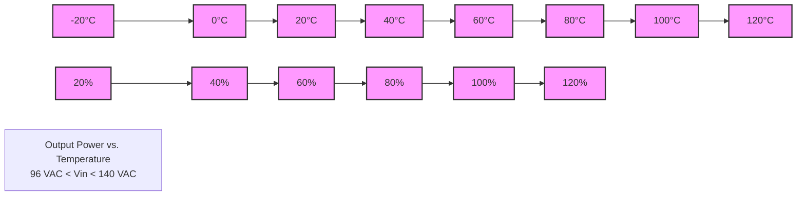

# Chunk 1
# Vertiv™ eSure™ Inverter
I120-1000

If you're looking for a reliable AC and DC backup solution without sacrificing space and efficiency, Vertiv™ eSure™ Inverter is the perfect choice.

# Chunk 2
## Benefits

- Optimally support fluctuating load requirements at 5G and edge sites over a wide operating temperature range
- Save precious space with market leading inverter power density (19 VA/in³)
- Minimize cost for energy with dual conversion functionality and high efficiency operation up to 95.2%
- Maximize site availability thanks to zero transfer time
- Ensure full control of site performance with NCU supervising complete back-up solution

# Chunk 3
## Description

The eSure™ Inverter I120-1000 is based on Vertiv's long experience from both highly reliable DC power and UPS systems, combining the best technologies from two worlds. The result is a power dense dual input (AC and DC) inverter with zero transfer time to keep important equipment running at any time. With the dual conversion topology of this inverter we can ensure that the load is running in the most efficient way and the rectifier investment can be kept to a minimum – supporting only battery recharge and DC loads.

The eSure Inverter offers a highly reliable, modular AC back-up solution that can be paralleled in steps of 1000 watts / 1000 VA. In terms of back-up capability, it can provide many hours of reserve time by utilizing the same battery bank as the DC plant. eSure Inverters can be factory configured in integrated Vertiv™ NetSure™ Inverter systems together with eSure™ rectifiers, where the entire system is controlled and monitored by a single NCU control unit. A stand-alone NetSure™ Inverter system is also available that can be field-added to an existing DC power system from any vendor.

% Efficiency

| Load%      | 10  | 20  | 30   | 40   | 50   | 60   | 70   | 80   | 90   | 100 |
| ---------- | --- | --- | ---- | ---- | ---- | ---- | ---- | ---- | ---- | --- |
| Efficiency | 90% | 93% | >94% | >94% | >94% | >95% | >95% | >95% | >95% | 95% |

I120-1000 AC/AC Peak Efficiency Curve at 120 VAC Nominal

# Chunk 4
## Technical Specifications

| AC Input     | AC Input                                        |
| ------------ | ----------------------------------------------- |
| Voltage      | 96 VAC to 140 VAC, 100 VAC to 125 VAC (nominal) |
| Frequency    | 50 Hz or 60 Hz                                  |
| Current      | Maximum: 8.8 A @ 120 VAC (11 A @ 96 VAC)        |
| Power Factor | >0.99 @ 100% linear load                        |
| THDi         | < 5% @100% linear load                          |

| DC Input | DC Input                                     |
| -------- | -------------------------------------------- |
| Voltage  | 42 to 58 VDC, 48 VDC (nominal)               |
| Current  | Maximum: 23.3 A @ -48 VDC (26.4 A @ -42 VDC) |

| AC Output                      | AC Output                                                                                                     |
| ------------------------------ | ------------------------------------------------------------------------------------------------------------- |
| Voltage                        | 120 VAC                                                                                                       |
| Frequency                      | 50 Hz or 60 Hz                                                                                                |
| Maximum Power                  | 1000 W / 1000 VA                                                                                              |
| Current                        | Maximum 8.4 A                                                                                                 |
| Peak Efficiency                | 95.2% AC/AC, 92% DC/AC                                                                                        |
| Temperature Performance        | Full power up to +45 °C (+113 °F) at input voltage range of 100 VAC - 125 VAC                                 |
| Over Capacity (fault clearing) | 110% to 125% @ 42VDC to 48VDC (15s), 125% @ 96VAC to 140VAC (15s), max input current 3x (120ms), per inverter |
| THD                            | < 3% @100% linear load                                                                                        |

| Control and Monitoring | Control and Monitoring                                     |
| ---------------------- | ---------------------------------------------------------- |
| Alarms and Signaling   | Alarm and status reported via CAN bus to system controller |
| Visual Indications     | Green LED: Normal Operation                                |
|                        | Yellow LED: Alarm                                          |
|                        | Red LED: Failure                                           |

| Environmental         | Environmental                                      |
| --------------------- | -------------------------------------------------- |
| Operating Temperature | -20°C to 80°C / -4°F to +176°F                     |
| Storage Temperature   | -40°C to 70°C / -40°F to +158°F                    |
| Relative Humidity     | 0 to 95%                                           |
| Altitude              | 3000 m, 10000 ft. (2000 m, 6562 ft. at full power) |

| Standards Compliance | Standards Compliance                                                                                                      |
| -------------------- | ------------------------------------------------------------------------------------------------------------------------- |
| Safety               | UL 1778; CUL, CSA C22.2 NO.107.3                                                                                          |
| EMC                  | IEC/EN 61000-4-2, IEC/EN 61000-4-5; GR-1089, FCC Part 15 (CFR47), Conducted Emission: Class A, Radiated Emission: Class B |
| MTBF                 | 750,000 hours (calculated) per Telcordia SR-332, Issue 2, Method 1                                                        |

| Mechanics              | Mechanics                                      |
| ---------------------- | ---------------------------------------------- |
| Dimensions (H x W x D) | 41 × 84.5 × 252.5 mm / 1.61 × 3.3 × 9.9 inches |
| Weight                 | 1.15 kg / 2.54 lbs                             |

# Chunk 5
## Figures

# Chunk 6
## Ordering Information

| Part Number | Description                                            |
| ----------- | ------------------------------------------------------ |
| 1I201000    | eSure™ Inverter module, single phase, 1.0 kVA, 120 VAC |

Vertiv.com | Vertiv Headquarters, 505 N Cleveland Ave, Westerville, OH, 43082, USA

© 2023 Vertiv Group Corp. All rights reserved. Vertiv™ and the Vertiv logo are trademarks or registered trademarks of Vertiv Group Corp. All other names and logos referred to are trade names, trademarks or registered trademarks of their respective owners. While every precaution has been taken to ensure accuracy and completeness here, Vertiv Group Corp. assumes no responsibility, and disclaims all liability, for damages resulting from use of this information or for any errors or omissions. Specifications, rebates and other promotional offers are subject to change at Vertiv's sole discretion upon notice.

I120-1000 (12/2023)

